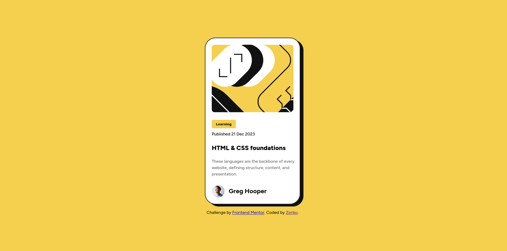

# Frontend Mentor - Blog preview card solution

This is a solution to the [Blog preview card challenge on Frontend Mentor](https://www.frontendmentor.io/challenges/blog-preview-card-ckPaj01IcS). Frontend Mentor challenges help you improve your coding skills by building realistic projects.

## Table of contents

- [Overview](#overview)
  - [Screenshot](#screenshot)
  - [Links](#links)
- [My process](#my-process)
  - [Built with](#built-with)
  - [What I learned](#what-i-learned)
  - [Continued development](#continued-development)
  - [Useful resources](#useful-resources)
- [Author](#author)

## Overview

### Screenshot

### Links

- Solution URL: [https://github.com/ZinLinnHtoo-zenko/profilecard](https://your-solution-url.com)
- Live Site URL: [https://zinlinnhtooprofilecardreview.netlify.app/](https://your-live-site-url.com)

## My process

### Built with

- Semantic HTML5 markup
- CSS custom properties
- Flexbox
- Mobile-first workflow

### What I learned

I solid my flex usage to align the elements. I also practice to write clean and memorable code when I looked back again. I am more and more aware of mobile first approach is worth as its layout style is simple so simple first and then turn into muliple. I notice my thinking time is less and less than before.

### Continued development

I need to learn more about image responsive layout as this makes me confuse to align different screen sizes. Maybe it's better to use @medi for responsive web design.

### Useful resources

- [Resource 1](https://chatgpt.com/) - For asking questions to understand concepts and clean code to write.
- [Resource 2] (https://developer.mozilla.org/en-US/) - This is also helpful for my progress because in this website, I can learn concepts with examples.

## Author

- Website - [Zenko](https://github.com/ZinLinnHtoo-zenko)
- Frontend Mentor - [@zenko](https://www.frontendmentor.io/profile/ZinLinnHtoo-zenko)
